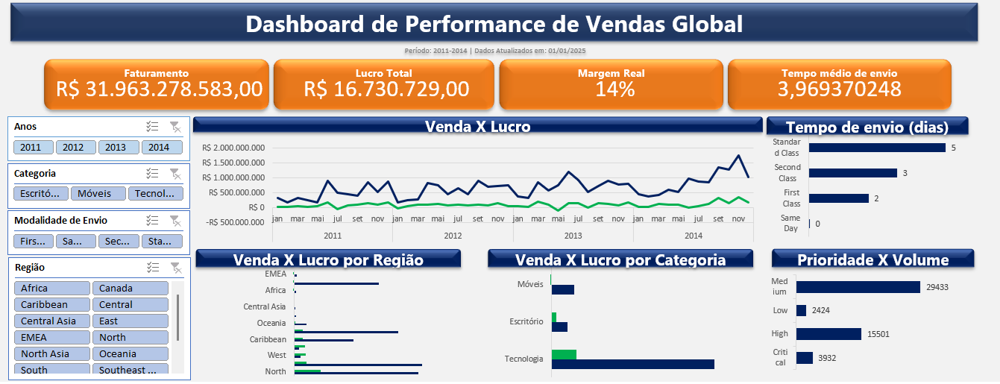

📊 Dashboard de Performance de Vendas Global

🎯 Objetivo do Projeto
Este projeto foi desenvolvido para transformar dados brutos de uma operação de varejo global em insights estratégicos, utilizando o dataset "global-superstore". O foco foi analisar a saúde financeira (lucro e margem) cruzando com a eficiência operacional da logística.

🛠️ Tecnologias e Ferramentas
Excel (Power Query): Processamento de +50k linhas, limpeza de dados (ETL), padronização de datas e criação de colunas Tempo de Entrega e Margem de Lucro

Modelagem de Dados: Criação de medidas de lucro e margem real via Campos Calculados para evitar distorções estatísticas.

Design de Dashboard: Aplicação de princípios de UX/UI para criar uma interface limpa, intuitiva e focada em tomada de decisão.

📈 Principais Funcionalidades
Análise Temporal: Evolução mensal de vendas permitindo identificar sazonalidades.

Visão de Rentabilidade: Comparativo entre Vendas e Lucro por Categoria e Região, destacando onde a operação é mais saudável.

Eficiência Logística: Monitoramento do tempo médio de envio por modalidade e volume por prioridade.

Interatividade Total: Filtros dinâmicos de Ano, Região, Categoria e Modalidade de Envio que sincronizam todos os indicadores simultaneamente.

💡 Insights de Negócio Extraídos

Erosão de Margem: Algumas categorias apresentam alto volume de vendas, porém com lucro desproporcional. Algumas regioes apresentam margem negativa em todas as categorias de produtos

🚀 Como visualizar
Faça o download do arquivo .xlsx na pasta dashboard.

Certifique-se de habilitar as macros/conteúdo se o Excel solicitar.

Navegue pela aba Dashboard e utilize os filtros laterais para explorar os dados.